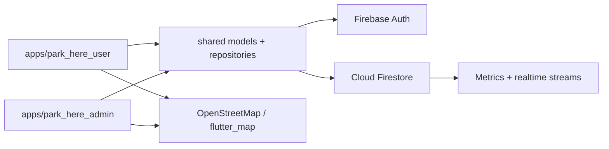

# Park Here

Park Here is a realtime smart parking occupancy system built with Flutter, Firebase, and OpenStreetMap. It includes a driver-facing user app, an administrator app, shared domain models, Firebase-backed persistence, controlled admin regions, parking-area geometry, QR-based verification, and realtime occupancy updates.

The project is student-built, but it follows a practical engineering shape: Firebase is the source of truth, app logic is split across user/admin/shared packages, maps are rendered with real OSM tiles, and runtime demo behavior comes from seeded Firebase data rather than hardcoded in-app repositories.

## Project Overview

Park Here helps drivers discover available parking and helps administrators manage parking areas inside controlled geographic regions.

The system is built around:

- Flutter apps for users and admins
- Firebase Auth for identity
- Cloud Firestore for realtime data
- OpenStreetMap rendering through `flutter_map`
- Realtime occupancy tracking
- Region-controlled admin management
- Status-only QR verification for booking lifecycle checks

Admins first register a controlled region, define its polygon boundary, and then create parking areas only inside that region. Users can browse realtime parking availability, inspect parking details, navigate toward an area, book parking, and use QR verification during entry/exit flows.

## Problem Statement

Parking availability is often invisible until a driver reaches the location. In campuses, local facilities, events, and city zones, parking areas may be unmanaged, occupancy may be stale, and users waste time moving between locations without knowing where space exists.

Park Here addresses this by making occupancy visible in realtime and by giving administrators a controlled-region workflow. Region control matters because parking data should be managed by the responsible local admin, and parking areas should not be created arbitrarily outside that admin's operational boundary.

## What We Built

- Realtime parking discovery for drivers
- Admin-controlled geographic regions
- Parking area polygons with boundary validation
- Gate-based parking access points
- Status-only QR booking lifecycle and privacy-aware ticket display
- Realtime occupancy and booking updates through Firestore
- Admin analytics and metrics views
- Firebase-backed persistence for runtime data
- OpenStreetMap-based map rendering and routing context
- Startup/session loading improvements for a smoother user app experience

## Architecture Overview

Park Here is a Flutter monorepo with two apps and a shared package.



Key architecture decisions:

- Firebase is the source of truth for users, admins, regions, parking areas, bookings, tickets, reviews, notifications, and issues.
- No runtime in-app demo data is used by the apps.
- Demo data is seeded into Firebase through scripts and then read like normal production data.
- Shared models and repositories keep user/admin behavior aligned.
- Firestore streams are scoped by feature so the apps avoid unnecessary full-screen reloads.
- Admin geometry validation keeps parking areas and gates inside the admin's controlled region.

## Key Features

- Realtime parking availability updates
- Region-restricted admin management
- OSM map polygon editing for regions and parking areas
- Gate management for entry, exit, and both-direction gates
- QR privacy model for booking verification
- Realtime Firebase streams for bookings, areas, issues, and notifications
- Route-aware parking navigation
- Admin metrics dashboard
- Firebase cache-aware loading and session restoration
- Responsive user and admin UI structure

## Technologies Used

- Flutter
- Dart
- Firebase Auth
- Cloud Firestore
- OpenStreetMap
- `flutter_map`
- Riverpod
- Firebase Storage-ready data model where media storage is needed
- Python demo/seed scripts

## Project Structure

```text
apps/
  park_here_user/      # Driver-facing Flutter app
  park_here_admin/     # Admin Flutter app for regions, parking areas, bookings, issues, metrics

shared/                # Shared Dart models, repositories, Firebase adapters, utilities
demo/                  # Firebase demo seed and helper scripts
docs/                  # Architecture, schema, setup, changelog, and implementation notes

firestore.indexes.json # Firestore composite index definitions
firestore.rules        # Firestore security rules
firebase.json          # Firebase project configuration
```

## Setup Instructions

1. Clone the repository.

   ```bash
   git clone <repository-url>
   cd smart-parking-occupancy-system
   ```

2. Install Flutter and confirm the local toolchain.

   ```bash
   flutter doctor
   ```

3. Configure Firebase.

   - Create or select a Firebase project.
   - Enable Firebase Auth.
   - Enable Cloud Firestore.
   - Add platform apps as needed.
   - Generate/update `firebase_options.dart` for each Flutter app.

4. Deploy Firestore indexes from the project root.

   ```bash
   firebase use park-here-dev
   firebase deploy --only firestore:indexes
   ```

5. Seed demo data into Firebase if needed.

   ```bash
   cd demo
   python seed_firestore_demo.py
   ```

6. Run the apps.

   ```bash
   flutter run -d chrome -t apps/park_here_user/lib/main.dart
   flutter run -d chrome -t apps/park_here_admin/lib/main.dart
   ```

For deeper environment notes, see [docs/LOCAL_SETUP.md](docs/LOCAL_SETUP.md).

## Demo Data

Demo data is loaded through Firebase seed scripts. The apps do not rely on hardcoded runtime demo repositories or local fake regions.

The seed data can include demo users, demo admins, admin-controlled regions, parking areas, bookings, QR tickets, reviews, notifications, and issue reports. Once seeded, the apps read that data from Firebase through the same repositories used by normal runtime flows.

## What Problems We Solved

- Realtime occupancy synchronization between user and admin apps
- Admin-controlled region registration before parking-area creation
- Region-safe parking area and gate geometry validation
- OSM-based polygon editing instead of fake rectangle-only maps
- Route-aware navigation context for drivers
- QR verification with privacy-conscious ticket display
- Firestore index alignment for repeated query patterns
- Startup/session restoration UX without login flicker
- Modular monorepo structure for shared Firebase-backed behavior

## Current Limitations

- The architecture is Firebase-first, so runtime behavior depends on configured Firebase services and indexes.
- Cloud Functions are not part of the current core flow; client apps and Firestore handle the active workflows.
- Routing and map context depend on external OpenStreetMap-compatible providers.
- Production-scale analytics can be improved later with server-side aggregation and historical rollups.

## Future Scope

- FASTag-style vehicle/payment integration
- ANPR or camera-assisted entry/exit automation
- AI-based occupancy prediction
- Server-side metrics aggregation
- Smart pricing based on demand and availability
- Multi-admin, multi-region scaling
- Dedicated operational dashboards for larger deployments

## Development Workflow

The stable integration branch is `main`. Do not commit directly to `main` for feature work.

Use approval/staging branches before changes reach `main`:

- `temp-user` for driver/user app work.
- `temp-admin` for admin app work.
- Isolated feature branches for addon/scanner work when needed.

Implement, test, commit, and push changes on the relevant staging branch first. Merge `temp-user` or `temp-admin` into `main` only after approval and validation.

## Documentation

Additional project documentation lives in [docs](docs):

- [Architecture](docs/ARCHITECTURE.md)
- [Firebase Schema](docs/FIREBASE_SCHEMA.md)
- [Local Setup](docs/LOCAL_SETUP.md)
- [Branch Workflow](docs/BRANCH_WORKFLOW.md)
- [Changelog](docs/CHANGELOG.md)
