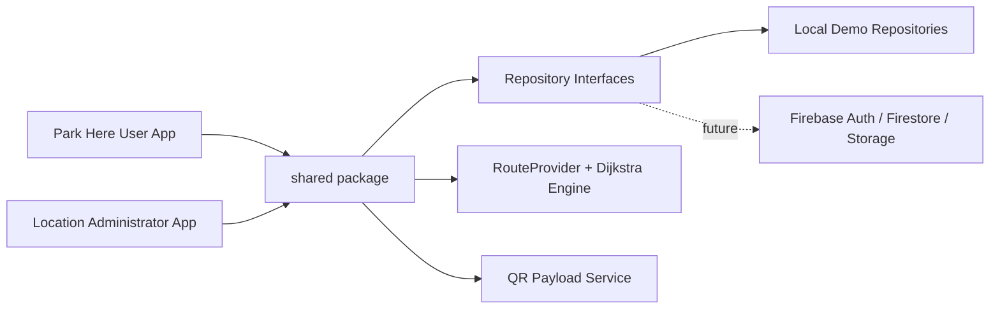
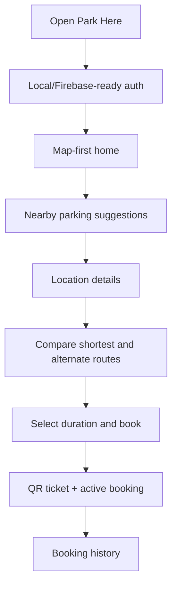
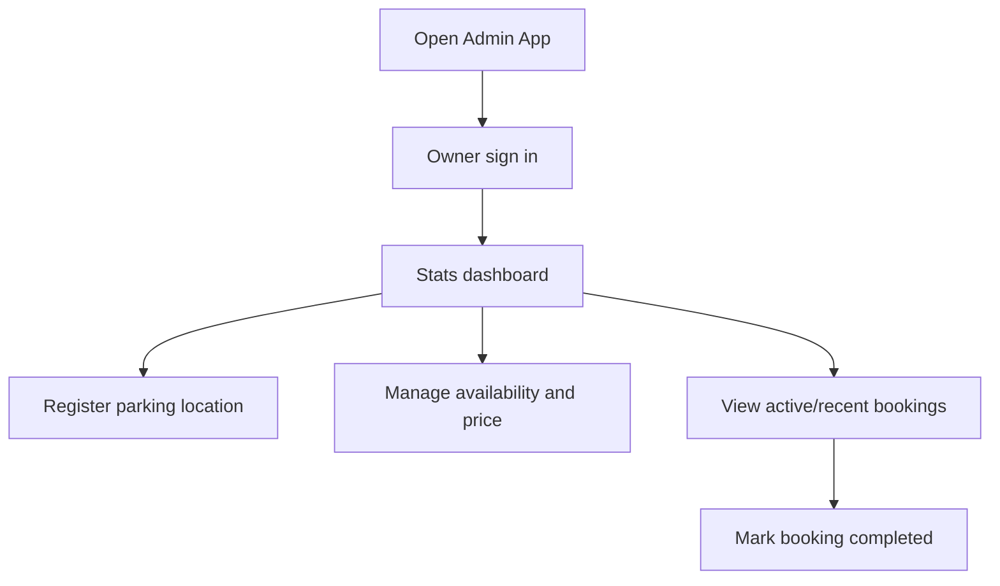
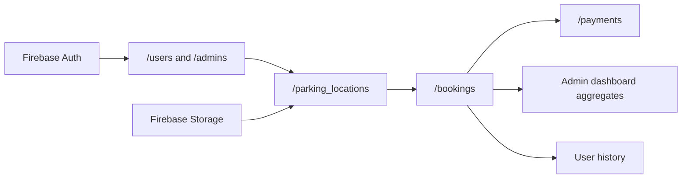
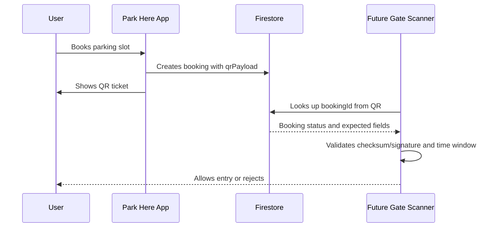

# Architecture

Park Here uses a clean, feature-first shape with a shared Dart package for domain models, repository contracts, fallback services, routing, QR payload generation, and theme tokens.



## User App Flow



## Admin App Flow



## Firebase Backend Flow



## QR Verification Flow



## Folder Strategy

```text
/apps
  /park_here_user
  /park_here_admin
/shared
  /lib/models
  /lib/services
  /lib/repositories
  /lib/routing
  /lib/utils
  /lib/theme
/docs
/scripts
```

