# Architecture

Park Here uses a clean, feature-first monorepo with two Flutter apps and a shared Dart package for models, repositories, services, routing, image handling, QR payloads, and theme tokens.

Normal runtime is Firebase-backed. Local in-memory repositories remain only for tests and explicit dev overrides; they are not the production app data source.

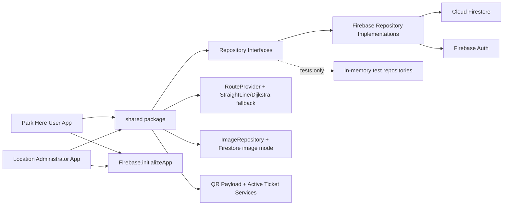

## User App Flow

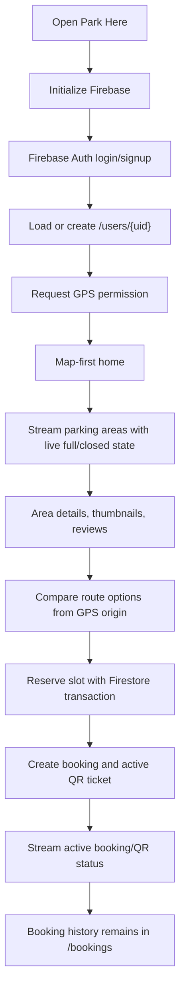

## User App Navigation

The user app now separates the mobility flow into five tabs instead of placing every feature on one screen:

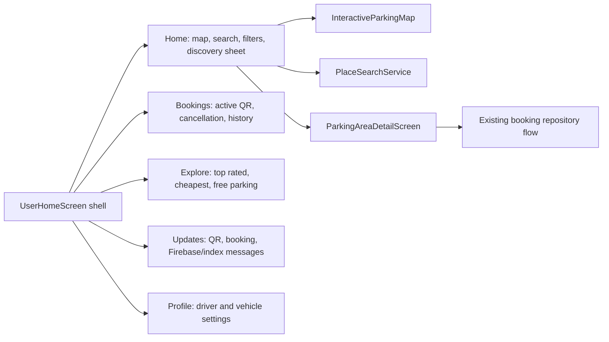

The tabs reuse `UserAppController` and the existing Firebase repositories. The refactor is display/navigation separation only; Firebase remains the source of truth for parking areas, bookings, QR tickets, reviews, issues, and image records.

## Map And Search Flow

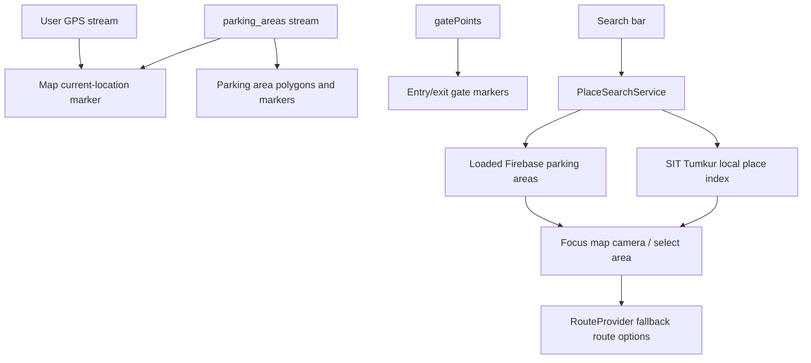

`PlaceSearchService` is an abstraction so Google Places, Nominatim, or another provider can be added later without putting API logic in widgets. Current runtime uses `LocalSitTumkurPlaceSearchService`, which is free/local-friendly and searches SIT Tumkur landmarks plus Firebase-loaded parking areas.

## Admin App Flow

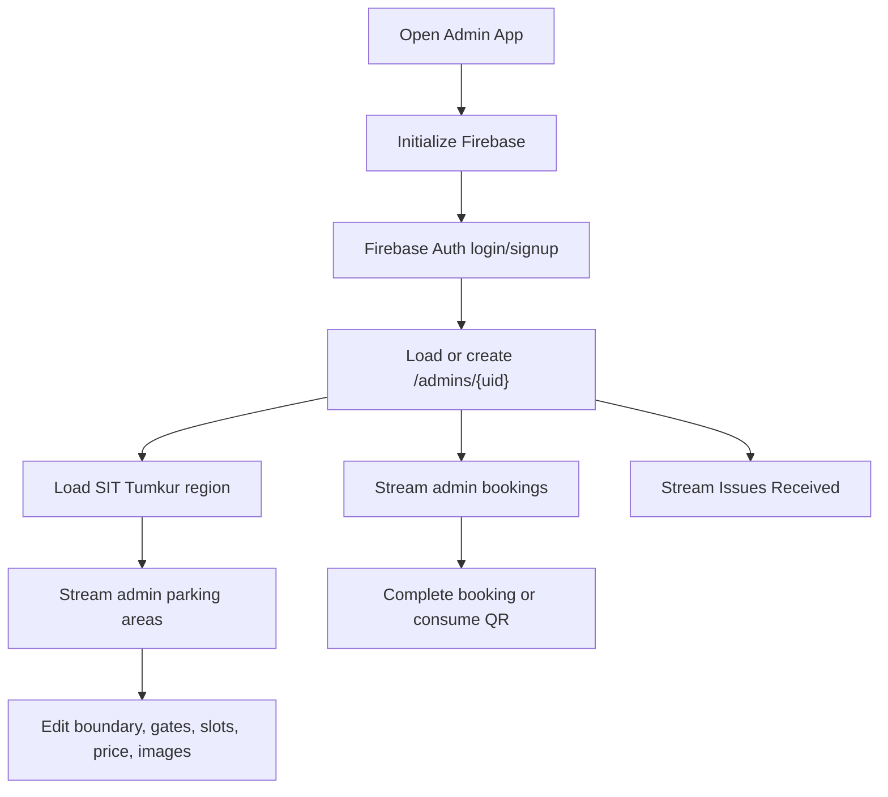

## Region To Parking Area Flow

SIT Tumkur is the current main region. Admins manage that region boundary, then publish bookable parking areas inside it. Users only see parking areas; the region is not a selectable parking object.

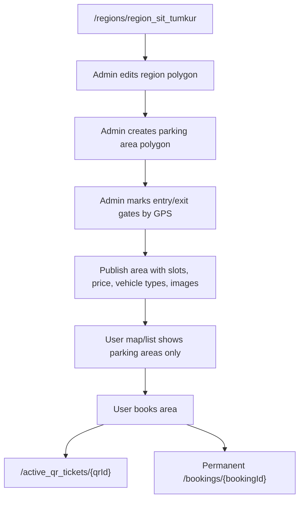

## Realtime Firebase Listener Flow

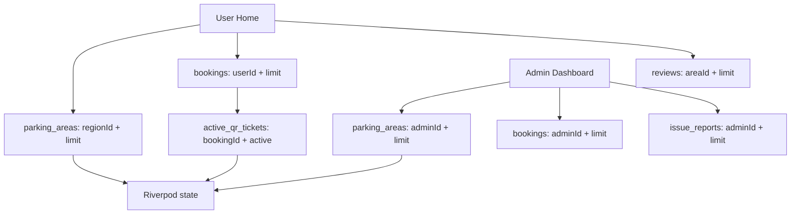

Bounded listeners are used only where live updates matter. Image payloads are lazy-loaded, not streamed as entire collections.

## Booking And QR Flow

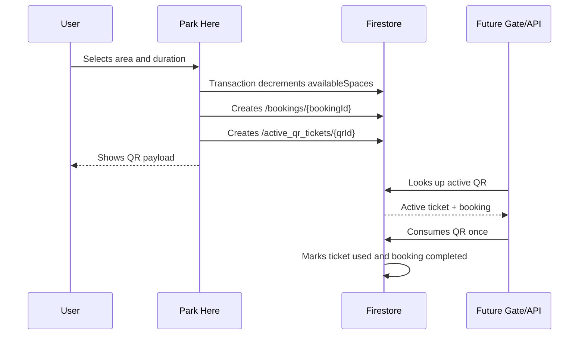

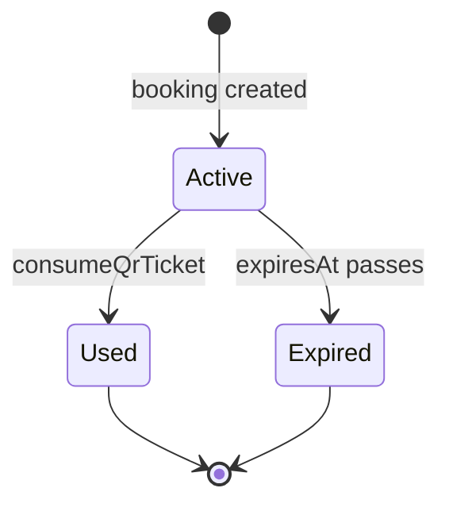

Booking history is never deleted. Active QR records are operational and may be marked `used` or expired.

Cancellation uses the booking repository transaction path. It marks the booking cancelled, records a `Rs. 10` fine only when the parking area's hourly price is above `Rs. 10`, expires the active QR, and releases the slot once.

## Admin GPS Marking Flow

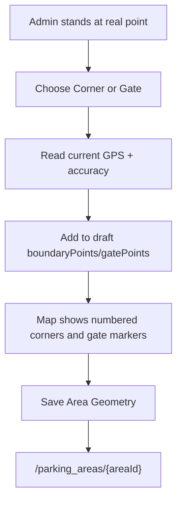

Poor GPS accuracy is shown in the Admin app. The seeded SIT Tumkur coordinates are approximate and should be corrected using this flow before real operation.

## Firestore-Only Image Flow

Firebase Storage may require billing, so the default image path is Firestore-only and optimized.

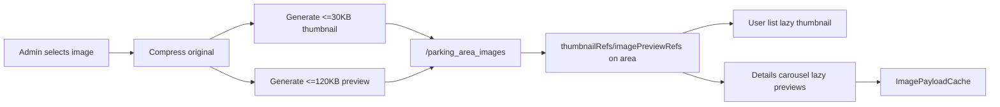

The repository boundary stays extensible:

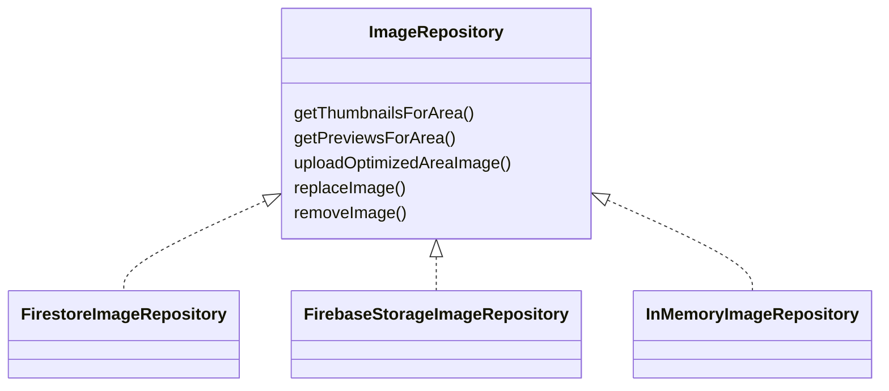

Default runtime uses `FirestoreImageRepository`. `FirebaseStorageImageRepository` is a future optional swap behind the same interface.

## Issue Report Flow

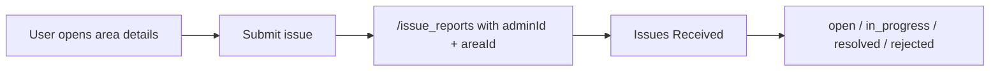

## Folder Strategy

```text
/apps
  /park_here_user
  /park_here_admin
/shared
  /lib/models
  /lib/services
  /lib/repositories
  /lib/routing
  /lib/utils
  /lib/theme
/docs
/scripts
/demo
```
