# Architecture

Park Here uses a clean, feature-first monorepo with two Flutter apps and a shared Dart package for models, repositories, services, routing, image handling, QR payloads, and theme tokens.

Normal runtime is Firebase-backed. Local in-memory repositories remain only for tests and explicit dev overrides; they are not the production app data source.

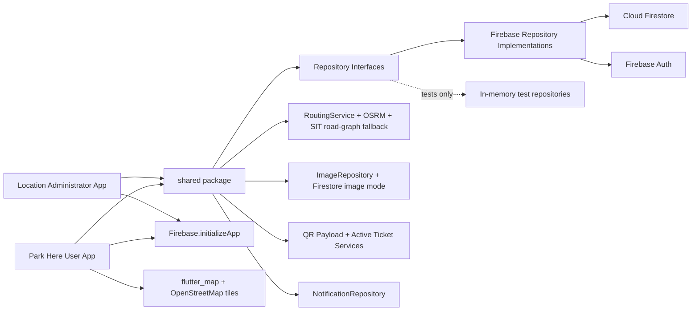

## User App Flow

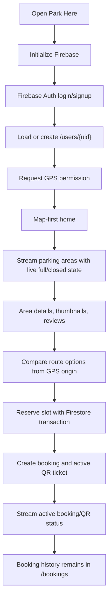

## User App Navigation

The user app now separates the mobility flow into five tabs instead of placing every feature on one screen:

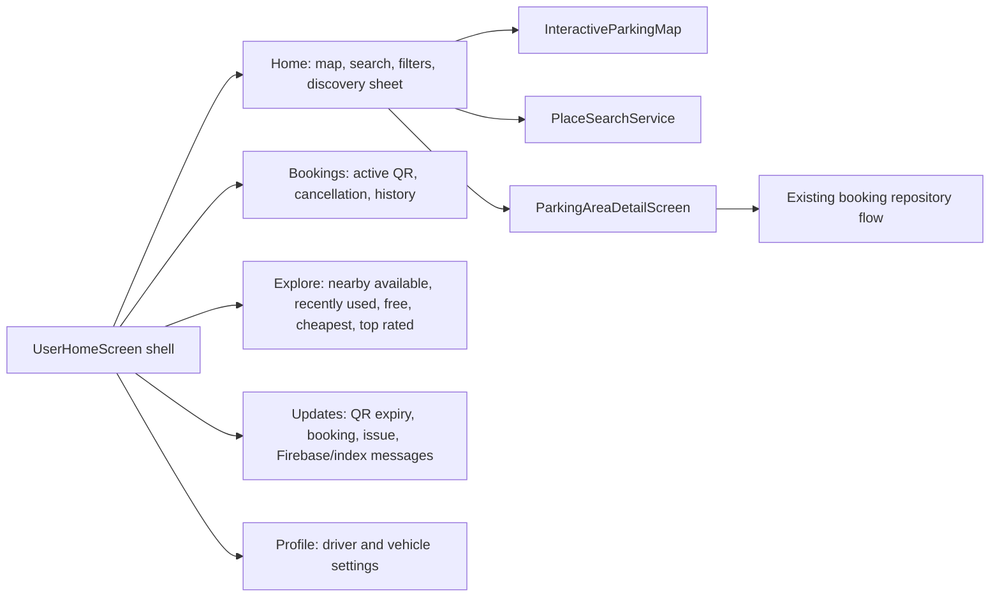

The tabs reuse `UserAppController` and the existing Firebase repositories. The refactor is display/navigation separation only; Firebase remains the source of truth for parking areas, bookings, QR tickets, reviews, issues, and image records.

## Map And Search Flow

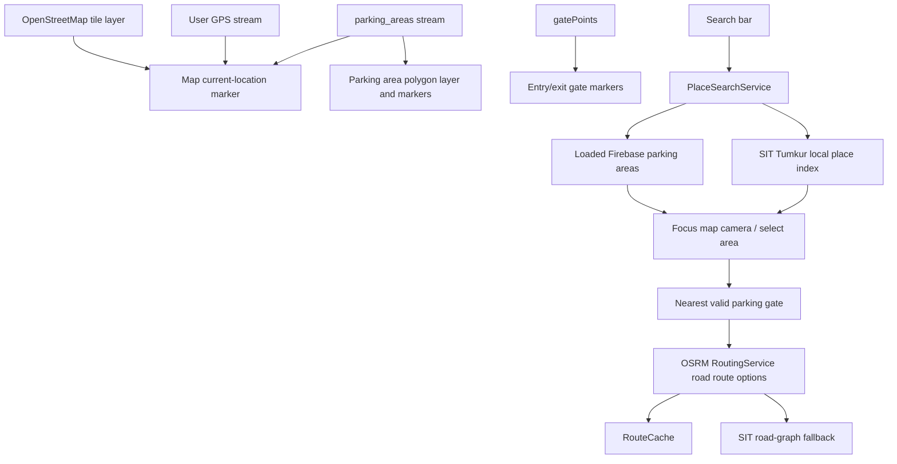

The user map uses `flutter_map` with public OpenStreetMap tiles for local development, then overlays Firebase parking polygons, gate markers, current GPS, and route polylines. OpenStreetMap does not require Google Maps billing or an API key, but production traffic should use an OSM-compliant tile provider or self-hosted tiles.

Routes now come from `OsrmRouteProvider` first, not straight-line geometry. The provider requests OSRM road-network routes with full GeoJSON geometry, caches recent responses in memory, and falls back to a small SIT Tumkur weighted road graph only when the road-routing API is unavailable. `ParkingGateSelector` routes to the nearest valid entry/both gate before falling back to a parking area center.

`PlaceSearchService` is an abstraction so Google Places, Nominatim, or another provider can be added later without putting API logic in widgets. Current runtime uses `LocalSitTumkurPlaceSearchService`, which is free/local-friendly and searches SIT Tumkur landmarks plus Firebase-loaded parking areas.

## Admin App Flow

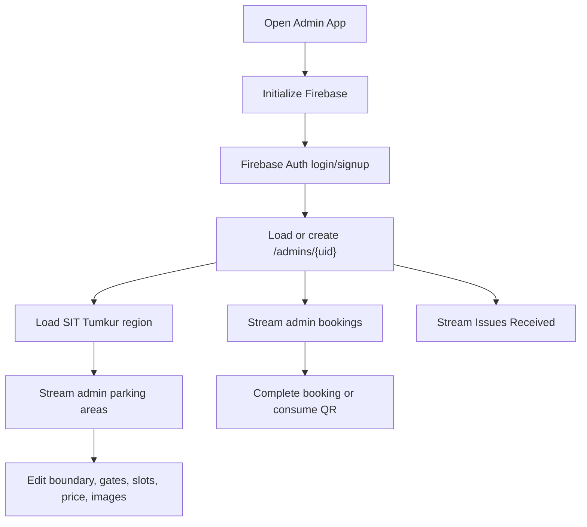

## Admin App Navigation

The admin app is now separated into focused operational sections instead of one dense dashboard. The shell uses bottom navigation on mobile and a `NavigationRail` on tablet/web widths. Section selection lives in `AdminAppState.section`, so Firestore stream updates do not reset the selected tab.

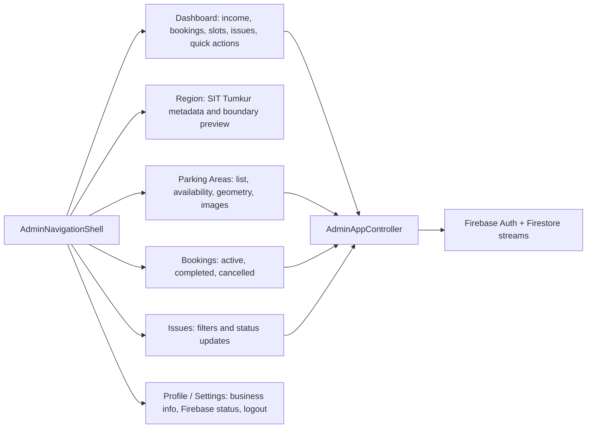

Visual direction is practical and Namma-Yatri-inspired: warm yellow accents, black text, off-white app background, green for available/open states, grey for inactive/closed states, and simple cards/chips. The admin app remains operational rather than decorative.

## Region To Parking Area Flow

SIT Tumkur is the current main region. Admins manage that region boundary, then publish bookable parking areas inside it. Users only see parking areas; the region is not a selectable parking object.

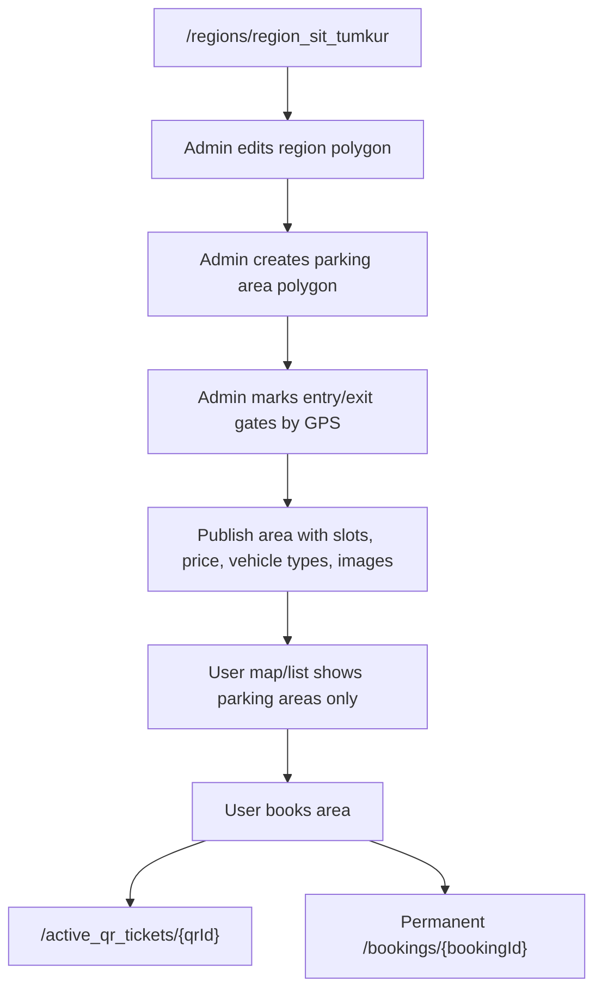

## Realtime Firebase Listener Flow

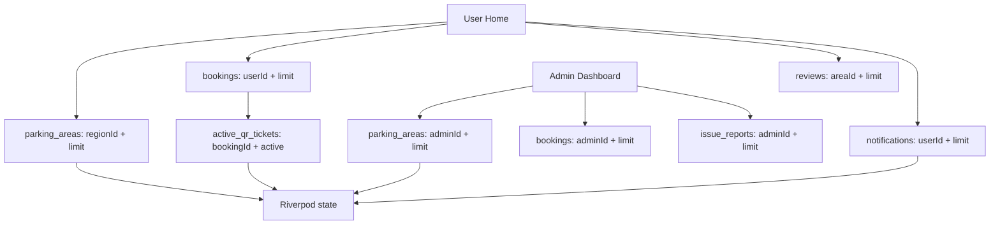

Bounded listeners are used only where live updates matter. Image payloads are lazy-loaded, not streamed as entire collections.

The user Home screen treats Firestore streams as the live data path after login. Parking area snapshots replace only the lightweight area list, keep the selected area by id when it still exists, and preserve search text, filter chips, current tab, and bottom-sheet context. The retry control restarts bounded listeners without calling the global app load path, so an index/network retry does not wipe the map or navigation state.

Booking creation updates Firestore first, then writes an optimistic local booking/active QR state for immediate confirmation. The regular bookings, active QR, and parking area listeners remain the source of truth and reconcile the UI as soon as Firestore emits the next snapshots.

## Booking And QR Flow

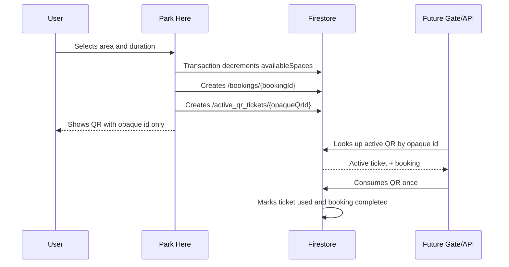

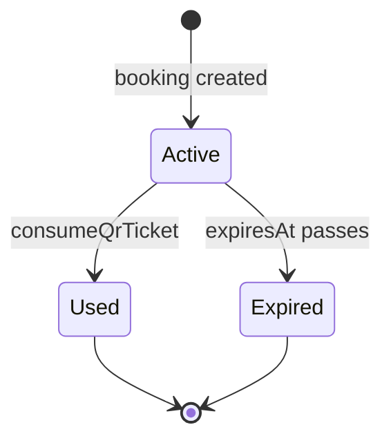

Booking history is never deleted. Active QR records are operational and may be marked `used` or expired.

QR codes are privacy-preserving: rendered QR data is only `qr_live_...`. User id, vehicle number, booking id, admin id, and area id are looked up through Firebase by the future gate/API, not exposed inside the QR image.

## Notification Flow

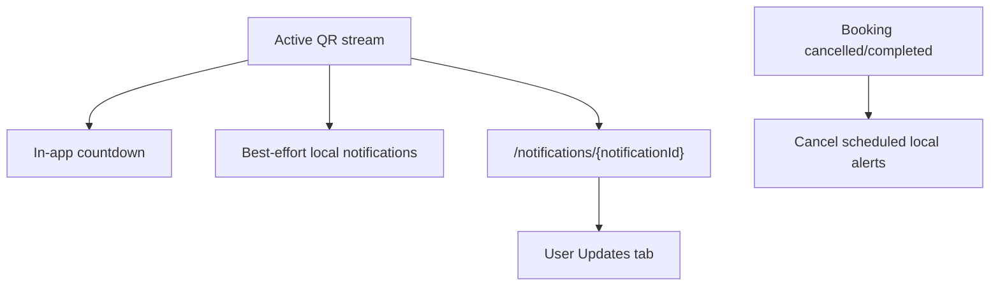

The app schedules QR expiry alerts at 10 minutes, 2 minutes, and expiry where platform APIs allow it. Web may ignore local notifications or screen brightness changes, so the Updates tab and QR countdown remain the reliable in-app path.

## Client Cache Strategy

Park Here is Flutter + Firebase only, so Redis is not embedded in the app. Client-side caching is used instead:

- Firestore offline persistence for user runtime reads where the platform supports it.
- Riverpod `UserAppState` as the current session cache for parking areas, bookings, QR, reviews, and notifications.
- `ImagePayloadCache` for optimized Firestore image payloads.
- Last known GPS position from `GeolocatorUserLocationService` while the app session is alive.
- Lazy thumbnail/preview fetching instead of streaming image blobs.

Redis would only make sense later behind a FastAPI/Node/Cloud Run backend that aggregates high-volume analytics or external routing/search results.

Cancellation uses the booking repository transaction path. It marks the booking cancelled, records a `Rs. 10` fine only when the parking area's hourly price is above `Rs. 10`, expires the active QR, and releases the slot once.

## Admin GPS Marking Flow

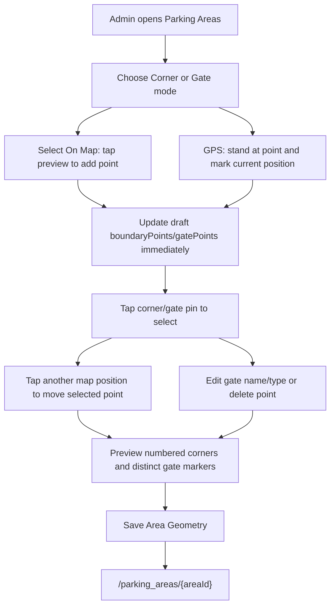

Poor GPS accuracy is shown in the Admin app. The seeded SIT Tumkur coordinates are approximate and should be corrected using this flow before real operation.

The admin geometry surface is currently a lightweight preview of saved polygons, numbered corner points, and gate points. It is not wired to the real `flutter_map` OpenStreetMap tile stack yet. The user app uses real OSM tiles; admin can safely keep editing Firebase geometry through GPS controls and select-on-map mode until an OSM editor is added.

Because the admin preview does not use draggable map markers yet, point adjustment uses an explicit fallback interaction: tap an existing corner or gate to select it, then tap the desired position to move it. This is intentionally documented as tap-to-select/tap-to-move rather than true dragging.

Before saving geometry, the controller validates that the selected area belongs to `region_sit_tumkur`, has at least three polygon corners, uses a price within `0..100`, and has `availableSpaces` between `0` and `totalSpaces`. Draft edits remain local until Save writes the updated area document to Firebase, after which the Firestore stream refreshes the selected area.

## Firestore-Only Image Flow

Firebase Storage may require billing, so the default image path is Firestore-only and optimized.

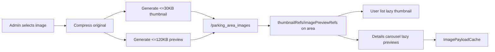

The repository boundary stays extensible:

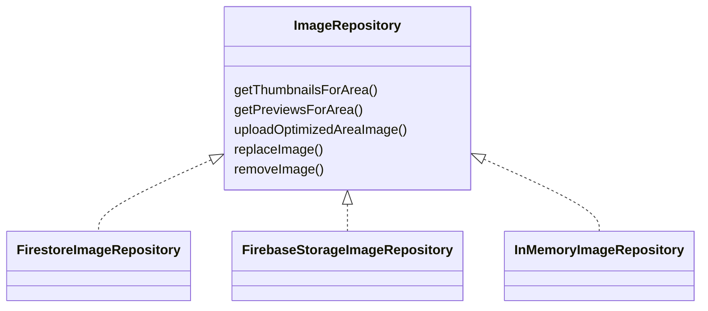

Default runtime uses `FirestoreImageRepository`. `FirebaseStorageImageRepository` is a future optional swap behind the same interface.

## Issue Report Flow

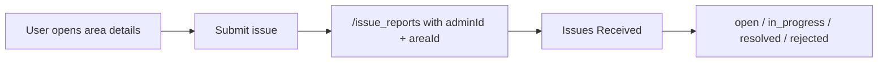

## Folder Strategy

```text
/apps
  /park_here_user
  /park_here_admin
/shared
  /lib/models
  /lib/services
  /lib/repositories
  /lib/routing
  /lib/utils
  /lib/theme
/docs
/scripts
/demo
```
