# Architecture

Park Here uses a clean, feature-first shape with a shared Dart package for domain models, repository contracts, fallback services, routing, QR payload generation, and theme tokens.

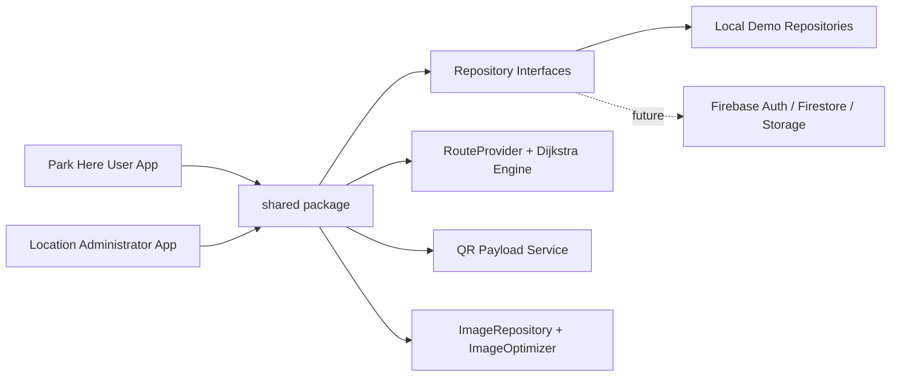

## User App Flow

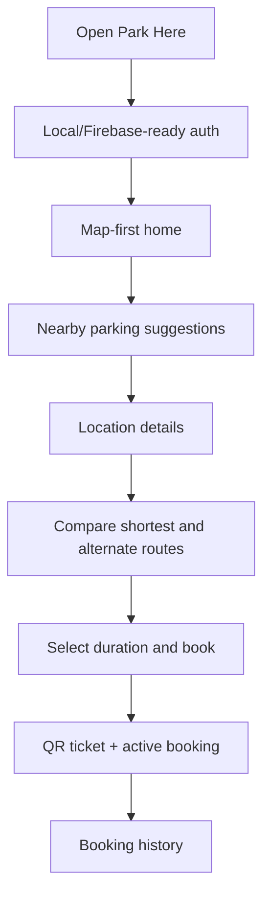

## Admin App Flow

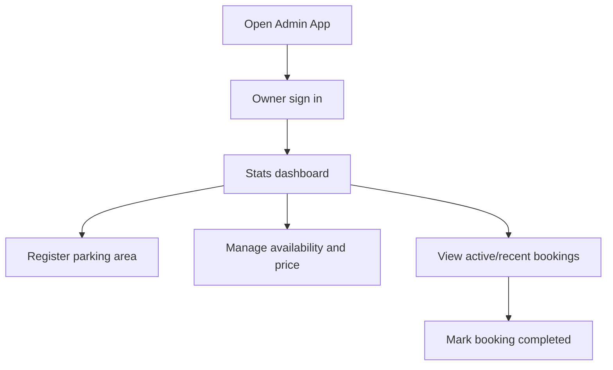

## Region To Parking Area Flow

SIT Tumkur is the current demo region. Admins manage that boundary and then publish bookable parking areas inside it. Users only see parking areas, never the region as a selectable parking object.

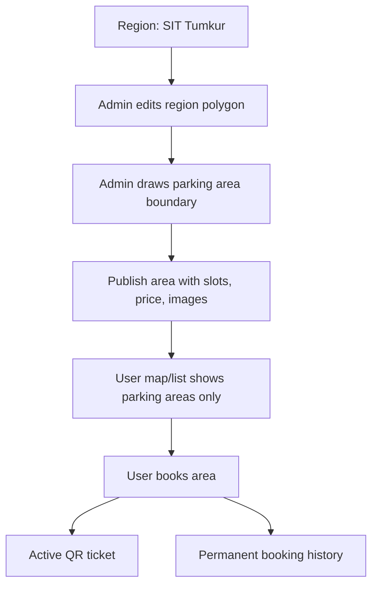

## Issue Report Flow

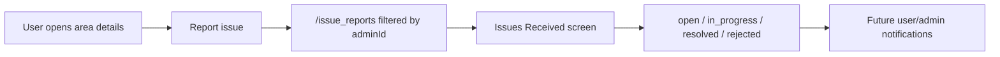

## Firebase Backend Flow

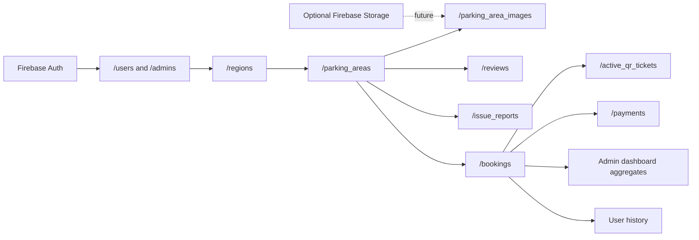

## Realtime Listener Flow

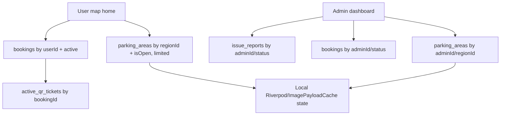

## Hybrid Image Flow

Firebase Storage can require a pay-as-you-go billing setup, so Park Here does not make Storage mandatory. The default image path stores only compressed, Firestore-safe image payloads in a separate collection. Parking area documents keep lightweight references, not large base64 blobs.

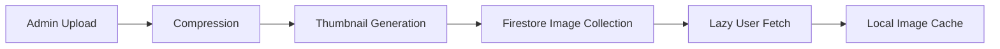

The repository boundary stays extensible:

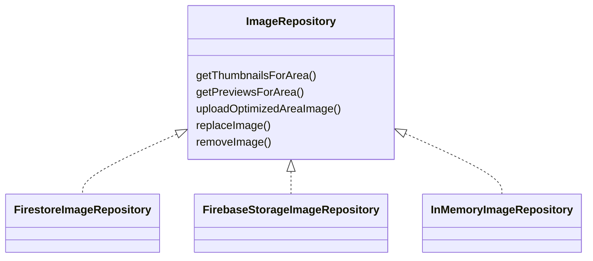

Default mode:

- `InMemoryImageRepository` locally
- `FirestoreImageRepository` when Firebase is enabled
- `FirebaseStorageImageRepository` only when Storage billing/config is acceptable

Image performance rules:

- Generate thumbnail and preview versions before upload.
- Store image payloads in `/parking_area_images`, not in `/parking_areas`.
- Keep thumbnails under 30KB and previews under 120KB.
- Load one thumbnail per parking area in list views.
- Lazy-load preview images only when the user opens area details.
- Cache fetched image records locally.
- Use query limits and pagination for large image sets.

## QR Verification Flow

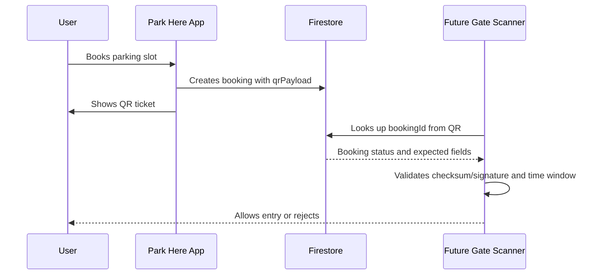

Active QR tickets are short-lived records. Booking history is permanent.

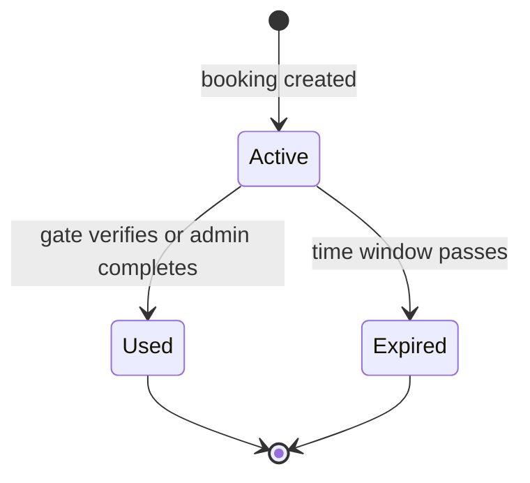

## Folder Strategy

```text
/apps
  /park_here_user
  /park_here_admin
/shared
  /lib/models
  /lib/services
  /lib/repositories
  /lib/routing
  /lib/utils
  /lib/theme
/docs
/scripts
/demo
```
