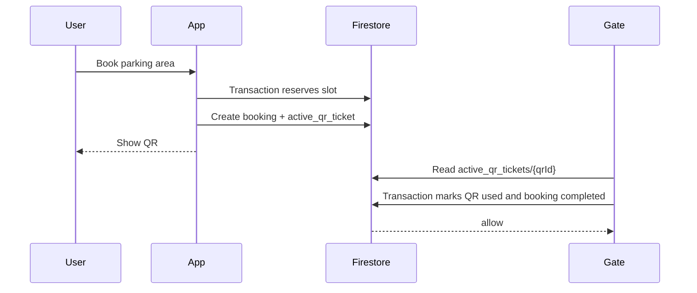

# QR Verification Flow

The MVP creates a QR-ready booking payload in the user app and stores the same payload on the booking record. Hardware gate scanning is intentionally outside this repository, but the data shape is ready for it.

## Payload

The QR payload is a JSON string:

```json
{
  "issuer": "park_here",
  "bookingId": "book_...",
  "qrId": "qr_book_...",
  "userId": "user_...",
  "parkingLocationId": "area_...",
  "vehicleNumber": "KA 05 MN 4242",
  "startTime": "2026-05-17T10:00:00.000",
  "endTime": "2026-05-17T12:00:00.000",
  "version": 1,
  "signature": "local-checksum"
}
```

## MVP Verification Idea

1. The app reserves one parking area slot.
2. The app creates `/bookings/{bookingId}` with `status: active`, `qrId`, and `qrPayload`.
3. The app creates `/active_qr_tickets/{qrId}` with `status: active`.
4. The driver shows the QR at the entry gate.
5. A future scanner reads `qrId`, `bookingId`, `vehicleNumber`, time window, and signature.
6. The scanner calls Firestore or a small API to fetch both records.
7. The scanner compares:
   - booking exists
   - active QR ticket exists
   - QR ticket status is `active`
   - booking status is `active`
   - `areaId` / `parkingLocationId` matches the gate
   - current time is between `startTime` and `endTime`
   - scanned vehicle matches `vehicleNumber`
   - signature is valid
8. On success, the scanner/API consumes the QR ticket and keeps booking history.

## Active QR Lifecycle



`/active_qr_tickets/{qrId}` may be marked `used` or `expired`. The permanent booking remains in `/bookings/{bookingId}` for user/admin history and income reporting.

Firestore verification should use a transaction or callable API so two scanners cannot consume the same QR at the same time:

1. Read `active_qr_tickets/{qrId}`.
2. Reject if missing, not `active`, or expired.
3. Read linked `/bookings/{bookingId}`.
4. Reject if booking is not `active`.
5. Update QR status to `used`.
6. Update booking status to `completed` and set `qrUsedAt`.

## Production Signing

The current checksum is useful for local demos, not security. Production should sign the payload server-side using an HMAC secret or asymmetric key. The gate should verify the signature without exposing the private signing secret to mobile clients.

## Firestore/API Option

For small pilots, the gate can use a locked-down service account or callable HTTPS function:

```text
POST /verify-booking
{
  "bookingId": "...",
  "parkingLocationId": "...",
  "qrPayload": "..."
}
```

The API returns `allow`, `reject_reason`, and optional booking metadata. This keeps security rules simple and avoids putting broad Firestore credentials on gate devices.
