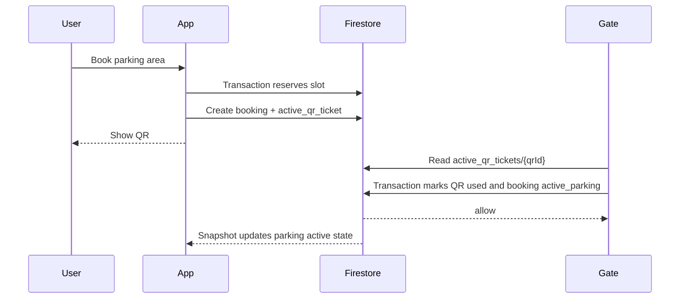

# QR Verification Flow

The user app creates a privacy-preserving QR ticket and the standalone scanner app consumes it through the same Firebase project. ESP32 hardware remains the primary gate path, while the Android scanner app is the fallback verifier.

## Payload

The QR code now contains only one opaque live QR id:

```text
qr_live_xxxxxxxxxxxxxxxxxxxxxxxxxxxxxxxx
```

It must not contain `userId`, `adminId`, `areaId`, vehicle number, booking JSON, timestamps, or signatures. The app stores the full mapping only in Firebase:

```text
/active_qr_tickets/{qrId}
  qrId
  bookingId
  userId
  adminId
  areaId
  status
  createdAt
  expiresAt
```

The parser remains migration-safe for old JSON QR payloads: it extracts `qrId` when present and never crashes. New QR generation always writes opaque ids only.

## Verification Flow

1. The app reserves one parking area slot.
2. The app creates `/bookings/{bookingId}` with `status: active`, `qrId`, and `qrPayload`.
3. The app creates `/active_qr_tickets/{qrId}` with `status: active`.
4. The driver shows the QR at the entry gate.
5. The standalone scanner reads only `qrId`.
6. The scanner fetches the active QR and booking records from Firebase.
7. The scanner compares:
   - booking exists
   - active QR ticket exists
   - QR ticket status is `active`
   - booking status is `active` or `confirmed`
   - `areaId` / `parkingLocationId` matches the gate
   - current time is between `startTime` and `endTime`
8. On success, the scanner consumes the QR ticket, marks entry verified, and keeps booking history.

## Active QR Lifecycle



`/active_qr_tickets/{qrId}` may be marked `active`, `used`, `expired`, or `cancelled`. The permanent booking remains in `/bookings/{bookingId}` for user/admin history and income reporting.

Firestore verification should use a transaction or callable API so two scanners cannot consume the same QR at the same time:

1. Read `active_qr_tickets/{qrId}`.
2. Reject if missing, not `active`, or expired.
3. Read linked `/bookings/{bookingId}`.
4. Reject if booking is not `active` or `confirmed`.
5. Update QR status to `used`.
6. Update booking status to `active_parking`.
7. Set `entryVerified = true`, `entryScannedAt`, and `qrUsedAt`.

The scanner re-reads the QR state inside the transaction. A second scan of the same QR sees `used` and is rejected. The user app listens to booking snapshots, so it changes from the QR ticket state to `Parking Active` without a reload once the scanner writes `active_parking`.

## QR Expiry Alerts

The user app shows an active countdown in the booking QR viewer and writes in-app notification records before expiry. It also schedules best-effort local notifications at 10 minutes, 2 minutes, and expiry where the platform/plugin supports it. Web and some desktop targets may ignore brightness or local notification APIs; the in-app Updates tab remains the reliable fallback.

## Firestore/API Option

For small pilots, the gate can use a locked-down service account or callable HTTPS function:

```text
POST /verify-booking
{
  "qrId": "...",
  "parkingLocationId": "gate_area_id"
}
```

The API returns `allow`, `reject_reason`, and optional booking metadata. This keeps security rules simple and avoids putting broad Firestore credentials on gate devices.
