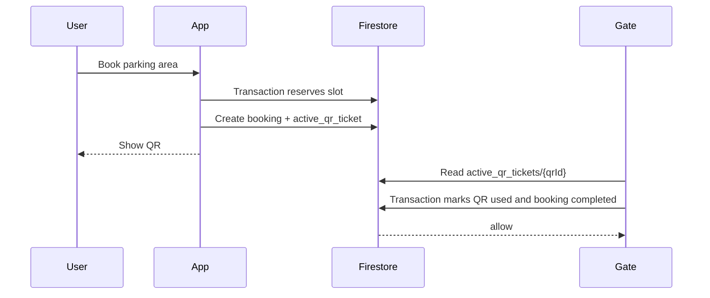

# QR Verification Flow

The MVP creates a privacy-preserving QR ticket in the user app. Hardware gate scanning is intentionally outside this repository, but the data shape is ready for it.

## Payload

The QR code now contains only one opaque live QR id:

```text
qr_live_xxxxxxxxxxxxxxxxxxxxxxxxxxxxxxxx
```

It must not contain `userId`, `adminId`, `areaId`, vehicle number, booking JSON, timestamps, or signatures. The app stores the full mapping only in Firebase:

```text
/active_qr_tickets/{qrId}
  qrId
  bookingId
  userId
  adminId
  areaId
  status
  createdAt
  expiresAt
```

The parser remains migration-safe for old JSON QR payloads: it extracts `qrId` when present and never crashes. New QR generation always writes opaque ids only.

## MVP Verification Idea

1. The app reserves one parking area slot.
2. The app creates `/bookings/{bookingId}` with `status: active`, `qrId`, and `qrPayload`.
3. The app creates `/active_qr_tickets/{qrId}` with `status: active`.
4. The driver shows the QR at the entry gate.
5. A future scanner reads only `qrId`.
6. The scanner calls Firestore or a small API to fetch the active QR and booking records.
7. The scanner compares:
   - booking exists
   - active QR ticket exists
   - QR ticket status is `active`
   - booking status is `active`
   - `areaId` / `parkingLocationId` matches the gate
   - current time is between `startTime` and `endTime`
8. On success, the scanner/API consumes the QR ticket and keeps booking history.

## Active QR Lifecycle



`/active_qr_tickets/{qrId}` may be marked `used` or `expired`. The permanent booking remains in `/bookings/{bookingId}` for user/admin history and income reporting.

Firestore verification should use a transaction or callable API so two scanners cannot consume the same QR at the same time:

1. Read `active_qr_tickets/{qrId}`.
2. Reject if missing, not `active`, or expired.
3. Read linked `/bookings/{bookingId}`.
4. Reject if booking is not `active`.
5. Update QR status to `used`.
6. Update booking status to `completed` and set `qrUsedAt`.

## QR Expiry Alerts

The user app shows an active countdown in the booking QR viewer and writes in-app notification records before expiry. It also schedules best-effort local notifications at 10 minutes, 2 minutes, and expiry where the platform/plugin supports it. Web and some desktop targets may ignore brightness or local notification APIs; the in-app Updates tab remains the reliable fallback.

## Firestore/API Option

For small pilots, the gate can use a locked-down service account or callable HTTPS function:

```text
POST /verify-booking
{
  "qrId": "...",
  "parkingLocationId": "gate_area_id"
}
```

The API returns `allow`, `reject_reason`, and optional booking metadata. This keeps security rules simple and avoids putting broad Firestore credentials on gate devices.
