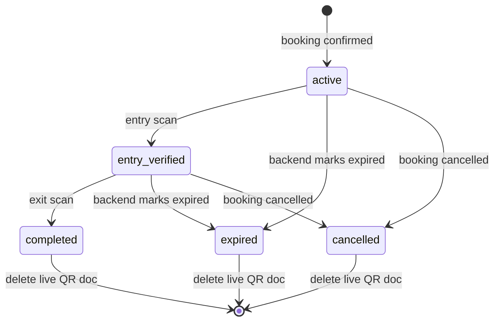

# QR Verification Flow

The user app creates a privacy-preserving QR ticket and the gate verifier reads the same Firebase records. This document matches the current user-app QR model: one opaque `qrId` and one lifecycle field on `/active_qr_tickets/{qrId}.status`.

## Payload

The rendered QR contains only the opaque live QR id:

```text
qr_live_xxxxxxxxxxxxxxxxxxxxxxxxxxxxxxxx
```

It must not contain `userId`, `adminId`, `areaId`, vehicle number, booking JSON, timestamps, or signatures. The full mapping stays in Firebase:

```text
/active_qr_tickets/{qrId}
  qrId
  bookingId
  userId
  adminId
  areaId
  status
  bookingStartAt
  bookingEndAt
  expiresAt
  entryScannedAt
  exitScannedAt
```

The parser remains migration-safe for old JSON QR payloads: it extracts `qrId` when present and does not crash. New QR generation writes opaque ids only.

## Booking Creation

1. The user selects a bookable `/parking_areas/{areaId}` document.
2. The app blocks booking if the user already has a `confirmed` or `active_parking` booking.
3. The app reserves one slot with a Firestore transaction.
4. The app creates `/bookings/{bookingId}` with `status = confirmed`, `qrId`, `qrPayload`, `bookingStartAt`, and `bookingEndAt`.
5. The app creates `/active_qr_tickets/{qrId}` with `status = active` and the same booking time range.
6. The Bookings tab listens to booking and active QR snapshots.

## Active QR Status



Allowed live `active_qr_tickets.status` values:

- `active`: booking exists and the next valid scan performs entry.
- `entry_verified`: entry scan is done; the same QR remains linked for exit.

The active QR status is the single source of truth while the QR is live. Final states are stored on `/bookings/{bookingId}` and the live QR document is deleted.

## User QR Visibility

- `active`: show the QR immediately with entry-gate guidance.
- `entry_verified`: show the same QR with exit-gate guidance.
- Missing active QR with booking `completed`, `expired`, or `cancelled`: hide the QR from the active booking section and show the booking in history.
- Expired status takes precedence over entry-verified display.

## Verifier Rules

The verifier should use a Firestore transaction so two scanners cannot update the same QR state at the same time:

1. Read `/active_qr_tickets/{qrId}`.
2. Read the linked `/bookings/{bookingId}`.
3. Reject if the QR is missing or scanned at the wrong `areaId`.
4. If ticket status is `active`, this is entry: set ticket `status = entry_verified`, set booking `status = active_parking`, and write `entryVerified`/`entryScannedAt`.
5. If ticket status is `entry_verified`, this is exit: set booking `status = completed`, write `exitScannedAt`/`completedAt`, and delete `/active_qr_tickets/{qrId}`.
6. If the live QR is missing, a verifier may inspect `/bookings` by `qrId` for diagnostics, but it must not recreate the active QR.

Expected plain-text verifier commands:

- `ENTRY`: entry verification succeeded.
- `EXIT`: exit verification succeeded and booking completed.
- `EXPIRED`: booking/QR is expired, already completed, or no longer live.
- `INVALID`: QR is malformed, missing, cancelled, or belongs to another parking area.
- `ERROR`: verifier or Firebase failure.

## Notifications

The user app shows live QR status in the booking QR viewer and writes in-app notification records for booking/QR updates. Web and some desktop targets may ignore brightness or local notification APIs; the Updates tab remains the reliable in-app fallback.
