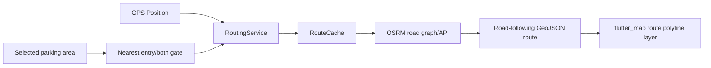

# Routing Engine

Park Here keeps navigation behind `RoutingService` / `RouteProvider`. Widgets render `RouteOption` polylines; they do not fetch routes, decode provider responses, choose gates, or run pathfinding.

## Why Straight Lines Were Wrong

The previous primary provider drew direct point-to-point geometry. That is useful only as a last-resort emergency estimate because it can cut through buildings, parking polygons, and roads that are not physically connected.

Runtime routing now uses road-network geometry first:

1. User GPS becomes the route origin.
2. The selected parking area's nearest valid `entry` or `both` gate becomes the destination.
3. `OsrmRouteProvider` requests OSRM road routes with `geometries=geojson`, `overview=full`, and `alternatives=true`.
4. The app parses the returned road polyline into `RouteOption.points`.
5. The map renders those points as the route layer and fits the camera to the selected route.



## Provider

The current road-aware provider is `OsrmRouteProvider`, using the public OSRM-compatible endpoint:

```text
https://router.project-osrm.org/route/v1/{profile}/{lon,lat;lon,lat}
```

OSRM routes over an OpenStreetMap road graph. Internally, routing engines use weighted graph shortest-path techniques over road nodes, edges, turn costs, and profile weights. That is the correct place for Dijkstra-style logic: on a road graph, not on arbitrary latitude/longitude straight lines.

For production traffic, use a dedicated OSRM deployment or a paid/free-tier routing provider with clear quota terms. The public OSRM endpoint is fine for development but should not be treated as guaranteed production infrastructure.

## Gate-Aware Destination

`ParkingGateSelector` chooses route destination like this:

- prefer gates where `type` is `entry` or `both`
- choose the nearest candidate gate to the current origin
- fallback to parking area center only when no entry/both gate exists

This keeps navigation aimed at a real access point instead of the polygon center.

## Alternatives

OSRM can return alternative routes when available. The app stores all returned routes in `UserAppState.routes`; details UI can select an alternative, and the map highlights the selected route while keeping other alternatives muted.

## Fallback Mode

Straight-line routing is no longer the primary provider.

Fallback order:

1. OSRM road-aware route.
2. `SitTumkurRoadGraphRouteProvider`, a small weighted road graph fallback for the SIT Tumkur demo region.
3. `StraightLineRouteProvider` may remain available for tests or emergency development only, and route options mark `isFallback=true`.

The fallback graph is intentionally explicit: nodes represent roads/intersections and edges represent road distances. Its Dijkstra behavior is graph-based, not raw coordinate distance. The first and last links still connect the live origin/gate to the nearest known road nodes, so it is a degraded approximation compared with OSRM.

## Caching

`RouteCache` keeps recent route responses in memory. Cache keys include:

- rounded origin coordinate
- rounded destination coordinate
- route profile

The default cache is lightweight, process-local, and expires entries after a short TTL. Redis is not used because this is a Flutter + Firebase app without a backend server. Redis would make sense later only if Park Here adds a FastAPI/Node/Cloud Run routing backend.

## Error Handling

If OSRM is unavailable, quota-limited, offline, or returns `NoRoute`, the app attempts the local road-graph fallback. If no route can be produced, route polylines are cleared and the user sees a routing error rather than a fake direct line.
