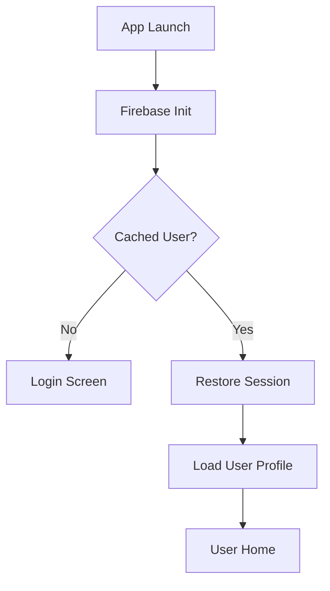
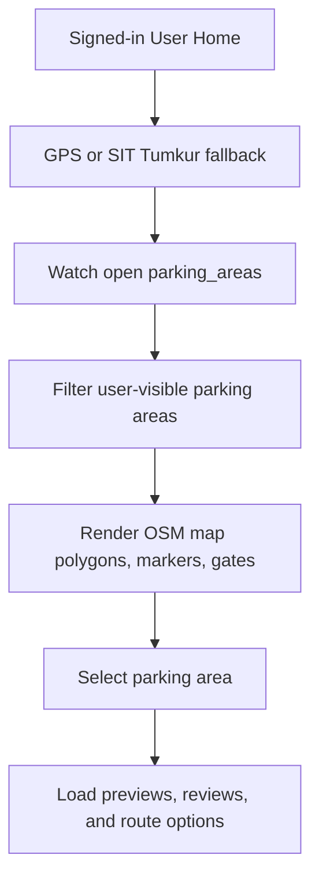
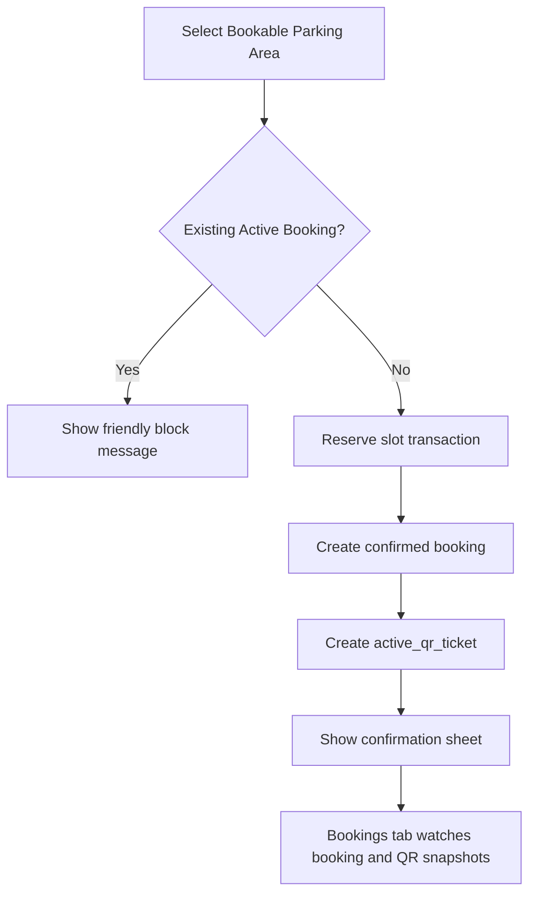
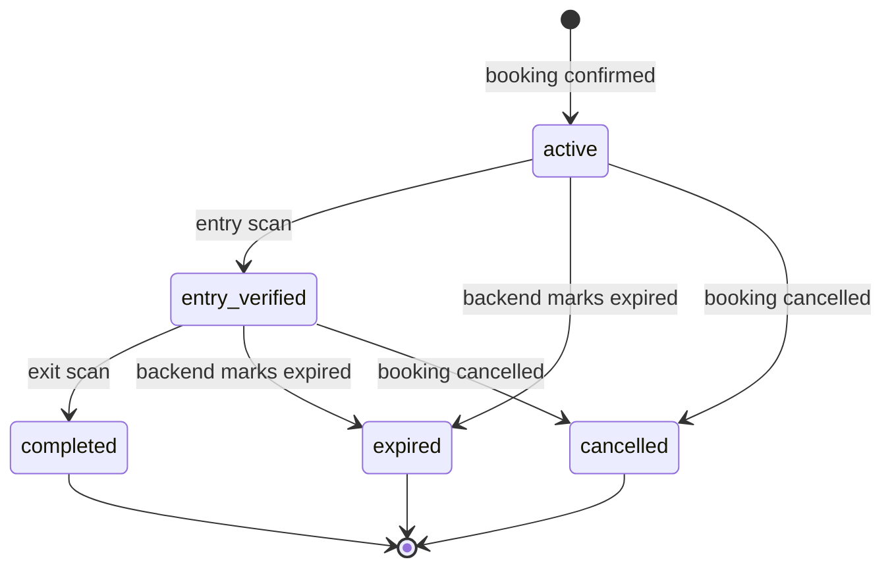

# Park Here User App Flow

This document describes the current Park Here user app implementation on `temp-user`. It is intentionally source-code aligned: it documents what the app does now, not planned admin or addon behavior.

## 1. User App Purpose

The user app is the driver-facing Park Here client. It lets a signed-in user discover Firebase parking areas, view OSM map context, inspect availability and pricing, book one active parking session, display an opaque QR ticket, review/report parking areas, and manage profile details.

The user app shows bookable parking areas from `/parking_areas`. Region documents are admin boundary containers only and are not rendered as bookable cards, markers, route destinations, or booking targets.

## 2. Startup And Login Flow



- `apps/park_here_user/lib/main.dart` initializes Firebase and enables Firestore offline persistence.
- `UserHomeScreen` shows `FirebaseSetupErrorScreen` if Firebase configuration fails.
- `UserAppController.load()` starts from `UserAuthStatus.checking`, shows `ParkHereLoadingScreen`, and calls `AuthService.loadCurrentUser()`.
- Signed-out users see a Firebase email/password login/signup form.
- Sign-up creates a user profile with name, phone, vehicle number, and vehicle type.
- Logout cancels realtime subscriptions, QR timers, and scheduled QR notifications, then returns to signed-out state.

## 3. Home Map Flow



- The map uses `flutter_map` with OpenStreetMap raster tiles.
- User GPS is requested through `Geolocator`; if unavailable, a SIT Tumkur fallback position is used with clear messaging.
- Parking areas stream from `/parking_areas` where `isOpen == true`, then are locally filtered with `isUserVisibleParkingArea`.
- Regions are not selectable/bookable in the user UI.
- Map overlays include parking polygons, center markers, gate markers, current location, selected place pins, and route polylines.
- Search is debounced and combines local SIT place results with Firebase-loaded parking areas.
- Filters are single-select toggles: All, Open, Nearest, Free, and Top rated.

## 4. Explore Flow

Explore is a list-first view over the same realtime parking state:

- Nearby available: bookable areas sorted by live/fallback distance.
- Recently used: areas from booking history, de-duplicated.
- Free parking: bookable areas with `pricePerHour == 0`.
- Cheapest parking: bookable areas sorted by price.
- Top rated: bookable areas sorted by rating.

Full or closed areas are excluded from bookable Explore sections.

## 5. Parking Area Detail Flow

Parking detail opens from Home cards or map selection.

It shows:

- preview images from `/parking_area_images`
- name, description/address, price, slot count, rating, and vehicle types
- route options and selected destination/gate context
- gate list when gate points exist
- duration slider from 1 to 12 hours
- Book button only when the area is bookable
- review sheet for rating/comment submission
- issue sheet for availability, pricing, access, or safety reports

Reviews write to `/reviews`; issues write to `/issue_reports`.

## 6. Booking Flow



- `UserAppController.createBooking()` requires a signed-in user and selected bookable parking area.
- A user cannot create another booking while a `confirmed` or `active_parking` booking exists.
- `FirebaseParkingRepository.reserveSlot()` decrements `availableSpaces` in a Firestore transaction.
- A booking starts as `confirmed`.
- `FirebaseBookingRepository.createActiveQrTicket()` creates an opaque `qrId` record in `/active_qr_tickets`.
- Cancellation is available before parking becomes active and may record a Rs. 10 fine when hourly price is above Rs. 10.

## 7. QR Ticket Lifecycle



The current lifecycle uses one field only:

```text
active_qr_tickets.status
```

Allowed statuses:

- `active`: booking exists; QR is visible and the next valid scan performs entry.
- `entry_verified`: entry scan is done; the same QR remains available for exit until the ticket reaches a final status.
- `completed`: exit scan is done; QR is no longer active.
- `expired`: booking time expired; QR is no longer active.
- `cancelled`: booking was cancelled; QR is no longer active.

The user app uses `active_qr_tickets.status` as the only QR lifecycle source.

QR visibility:

- `active`: QR visible immediately, labeled `Scan at entry gate`.
- `entry_verified`: same QR visible, labeled for exit.
- `completed`, `expired`, or `cancelled`: QR hidden from the active booking section.
- Expired status overrides entry display because `Booking.isParkingActive` only treats `active_parking` as active.

## 8. Booking History Flow

The Bookings tab shows:

- one active/current session when present
- all bookings in history sorted by creation time
- final status and price
- cancellation fine when recorded
- entry and exit timestamps when present

Completed and expired bookings remain in `/bookings`; QR lifecycle changes do not delete booking history.

## 9. Notifications Flow

- `/notifications` streams into the Updates tab by `userId`.
- Booking confirmation/cancellation writes in-app notification records.
- QR expiry threshold notifications are written in-app by controller timers.
- `QrExpiryNotificationService` schedules best-effort local notifications only while the active QR ticket status is `active`.
- Web and some desktop targets may ignore local notification or brightness APIs; the Updates tab is the reliable in-app view.

## 10. Profile Flow

The Profile tab shows:

- Firebase readiness message
- user UID
- editable name, phone, vehicle number, and default vehicle type
- booking/review/active-booking summary rows
- logout button

Saving profile updates the current Auth-backed user profile through `AuthService.updateUser()`.

## 11. Firebase Collections Used

Runtime user app repositories use Firebase by default:

- `/users/{uid}`: user profile and vehicle details.
- `/parking_areas/{areaId}`: bookable parking area data, geometry, slots, price, gates, ratings.
- `/parking_area_images`: thumbnails/previews for parking details.
- `/bookings/{bookingId}`: booking lifecycle and history.
- `/active_qr_tickets/{qrId}`: active QR status and entry/exit timestamps.
- `/reviews/{reviewId}`: ratings and comments.
- `/issue_reports/{issueId}`: user-submitted issues.
- `/notifications/{notificationId}`: in-app updates.

The user app does not use `/regions` as bookable data.

## 12. Current Limitations

- Firebase configuration is required; without it the app shows setup guidance.
- The app has local in-memory repositories for tests, but runtime providers use Firebase repositories.
- Routing uses OSRM with a SIT Tumkur road-graph fallback.
- QR expiry is reflected through Firebase/backend status; the UI does not apply local clock-window rules.
- Local notifications are best-effort and platform-dependent.
- Images are loaded lazily from Firestore image records and may show placeholders if unavailable.

## 13. Manual Test Checklist

- Fresh launch with no cached user shows loading, then login.
- Cached user shows loading, restores profile, and opens Home.
- Home map loads OSM tiles, parking polygons, markers, gates, and current/fallback location.
- Region names do not appear as bookable parking places.
- Search and filters preserve state while realtime snapshots update.
- Explore shows only bookable parking areas in nearby/free/cheap/rated sections.
- Details screen shows price, slots, ratings, routes, gates, reviews, issue reporting, and booking action.
- Booking a bookable area creates a confirmed booking and active QR ticket.
- A second active booking is blocked.
- QR is visible immediately when the active ticket status is `active`.
- After scanner entry sets `entry_verified`, the same QR remains visible for exit.
- After scanner exit sets `completed`, QR disappears and history shows completion.
- If backend marks booking/ticket `expired`, QR disappears and history shows expired status.
- Updates tab shows booking/QR/availability messages.
- Profile edits save and logout returns to login.
